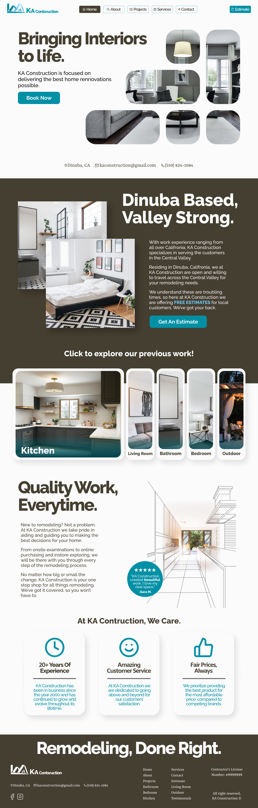
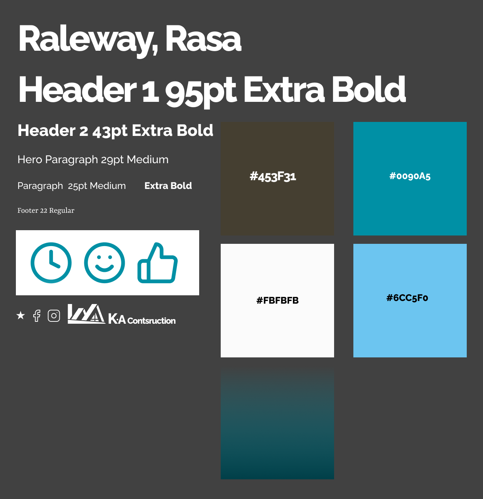

# K.A. Construction React Single Page Landing

## Table of contents

- [Overview](#overview)
  - [The challenge](#the-challenge)
  - [Screenshot](#screenshot)
  - [Links](#links)
- [My process](#my-process)
  - [Built with](#built-with)
  - [What I learned](#what-i-learned)
  - [Useful resources](#useful-resources)
- [Author](#author)

## Overview

### The challenge

### Designs

### Links

- Solution URL: [https://github.com/SyntheticDesigner/signup-form-main](https://github.com/SyntheticDesigner/k-a-construction)
- Live Site URL: [https://syntheticdesigner.github.io/signup-form-main/](https://syntheticdesigner.github.io/k-a-construction/)

## My process

### Built with

- Semantic HTML5 markup
- Custom CSS
- [React](https://reactjs.org/) - JS library
- [Styled Components](https://styled-components.com/) - For styles

### What I learned

### Useful resources

## Author

- Website - [Andrew Schroepfer](https://syntheticdesigner.github.io/)
- Social - [Linkedin](https://www.linkedin.com/in/andrew-schroepfer/)
